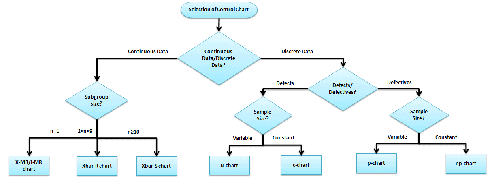
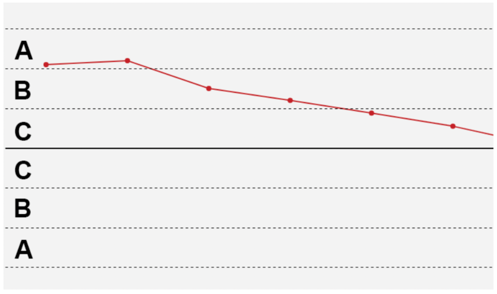
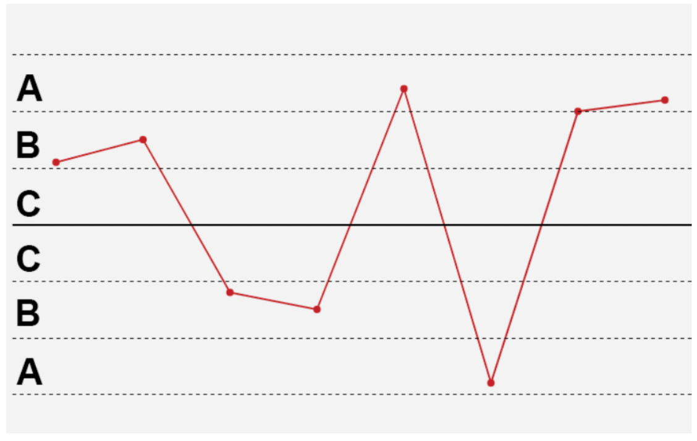
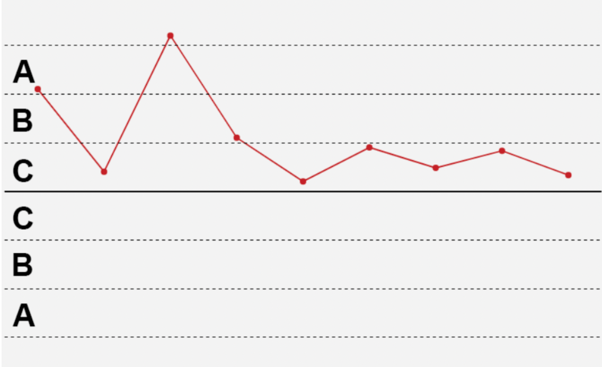
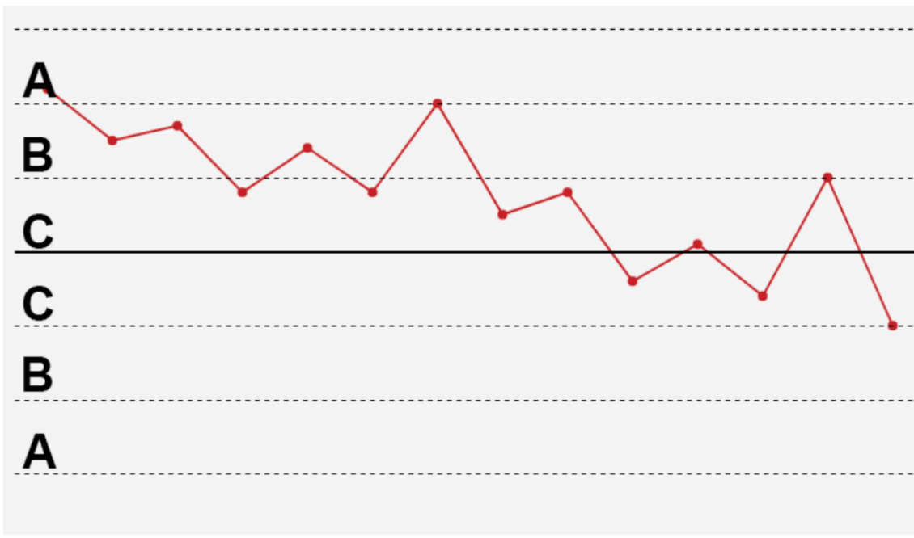
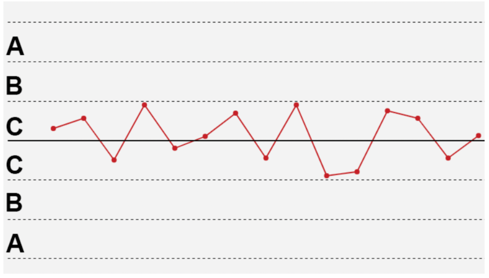

# spc
SPC (Statistical Process Control) is a method of monitoring and controlling manufacturing or business processes through statistical methods, aimed at ensuring that the process is always in a controlled state, thereby reducing variability and improving quality.

## Group Statistics
Support folwing charts:
* Xbar-R Chart
* Xbar-S Chart
* R Chart
* S Chart


## Attribute Statistics
Support folwing charts:
* P Chart
* NP Chart
* C Chart
* U Chart

## Moving Statistics
Support folwing charts:
* Individuals Chart
* Moving Range Chart
* Moving Average Chart


# How to choose an appropriate control chart



## SPC Rule
* **Rule1Beyond3Sigma**
    
* **Rule2Of3Beyond2Sigma**
    
* **Rule4Of5Beyond1Sigma**
    
* **Rule6PointsUpAndDown**
    
* **Rule8PointsAboveOrBelowCenter**
    
* **Rule9PointsOnSameSideOfCenter**
    
* **Rule14PointsOscillating**
    
* **Rule15PointsWithin1Sigma**
    


## Examples
```rust
    use spc_rs::group_stats::{GroupStats, GroupStatsChartType};
    pub fn main() {
        let v1 = vec![
            0.65, 0.75, 0.75, 0.60, 0.70, 0.60, 0.75, 0.60, 0.65, 0.60, 0.80, 0.85, 0.70, 0.65,
            0.90, 0.75, 0.75, 0.75, 0.65, 0.60, 0.50, 0.60, 0.80, 0.65, 0.65,
        ];
        let v2 = vec![
            0.70, 0.85, 0.80, 0.70, 0.75, 0.75, 0.80, 0.70, 0.80, 0.70, 0.75, 0.75, 0.70, 0.70,
            0.80, 0.80, 0.70, 0.70, 0.65, 0.60, 0.55, 0.80, 0.65, 0.60, 0.70,
        ];
        let v3 = vec![
            0.65, 0.75, 0.80, 0.70, 0.65, 0.75, 0.65, 0.80, 0.85, 0.60, 0.90, 0.85, 0.75, 0.85,
            0.80, 0.75, 0.85, 0.60, 0.85, 0.65, 0.65, 0.65, 0.75, 0.65, 0.70,
        ];
        let v4 = vec![
            0.65, 0.85, 0.70, 0.75, 0.85, 0.85, 0.75, 0.75, 0.85, 0.80, 0.50, 0.65, 0.75, 0.75,
            0.75, 0.80, 0.70, 0.70, 0.65, 0.60, 0.80, 0.65, 0.65, 0.60, 0.60,
        ];
        let v5 = vec![
            0.85, 0.65, 0.75, 0.65, 0.80, 0.70, 0.70, 0.75, 0.75, 0.65, 0.80, 0.70, 0.70, 0.60,
            0.85, 0.65, 0.80, 0.60, 0.70, 0.65, 0.80, 0.75, 0.65, 0.70, 0.65,
        ];

        let mut xbar_r_chart_stats =
            GroupStats::new(5, GroupStatsChartType::XbarRChart, None).unwrap();
        for i in 0..v1.len() {
            let _r = xbar_r_chart_stats
                .add_data(&vec![v1[i], v2[i], v3[i], v4[i], v5[i]])
                .unwrap();
        }

        let ucl = xbar_r_chart_stats.ucl();
        let lcl = xbar_r_chart_stats.lcl();
        let cl = xbar_r_chart_stats.cl();
        let average = xbar_r_chart_stats.average;
        let ranges = xbar_r_chart_stats.ranges;
        println!("ucl: {:.2}", ucl);
        println!("cl:  {:.2}", cl);
        println!("lcl: {:.2}", lcl);
        println!(
            "average: {:?}",
            average
                .into_iter()
                .map(|x| (x * 100.0).round() / 100.0)
                .collect::<Vec<f64>>()
        );
        println!(
            "range: {:?}",
            ranges
                .into_iter()
                .map(|x| (x * 100.0).round() / 100.0)
                .collect::<Vec<f64>>()
        );
    }

```